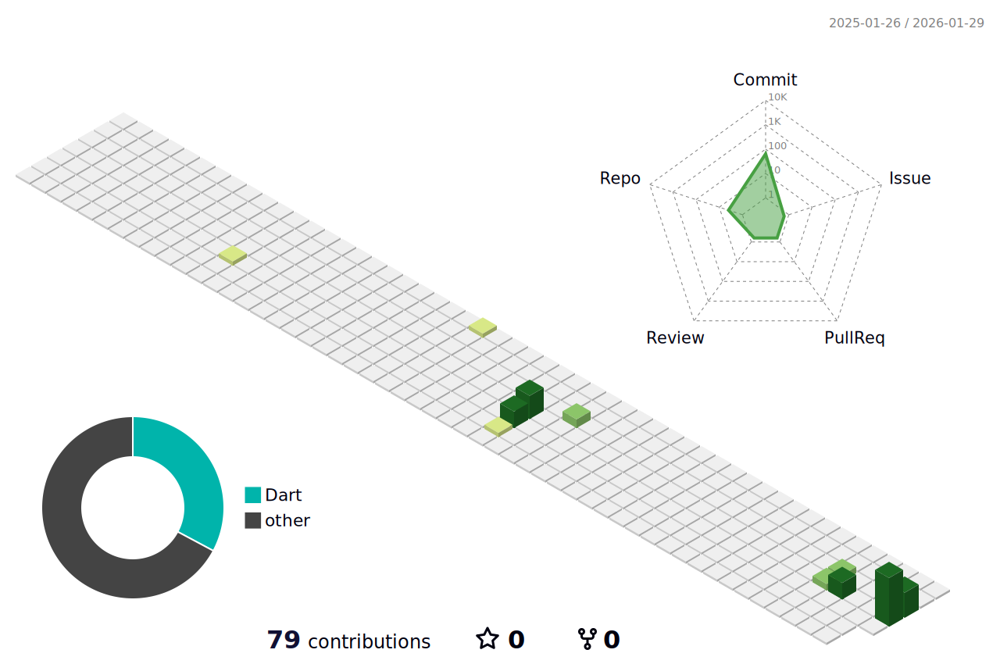

<p align="center">

</p>
<p align="center">
    
</p>


<!--START_SECTION:waka-->
**I'm a Night 🦉** 

```text
🌞 Morning                0 commits           ░░░░░░░░░░░░░░░░░░░░░░░░░   00.00 % 
🌆 Daytime                1 commits           ░░░░░░░░░░░░░░░░░░░░░░░░░   01.43 % 
🌃 Evening                30 commits          ███████████░░░░░░░░░░░░░░   42.86 % 
🌙 Night                  39 commits          ██████████████░░░░░░░░░░░   55.71 % 
```
📅 **I'm Most Productive on Wednesday** 

```text
Monday                   0 commits           ░░░░░░░░░░░░░░░░░░░░░░░░░   00.00 % 
Tuesday                  14 commits          █████░░░░░░░░░░░░░░░░░░░░   20.00 % 
Wednesday                48 commits          █████████████████░░░░░░░░   68.57 % 
Thursday                 7 commits           ██░░░░░░░░░░░░░░░░░░░░░░░   10.00 % 
Friday                   1 commits           ░░░░░░░░░░░░░░░░░░░░░░░░░   01.43 % 
Saturday                 0 commits           ░░░░░░░░░░░░░░░░░░░░░░░░░   00.00 % 
Sunday                   0 commits           ░░░░░░░░░░░░░░░░░░░░░░░░░   00.00 % 
```


📊 **This Week I Spent My Time On** 

```text
🕑︎ Time Zone: Asia/Shanghai

💬 Programming Languages: 
Markdown                 42 mins             ███████████████████░░░░░░   74.69 % 
JSON                     7 mins              ███░░░░░░░░░░░░░░░░░░░░░░   12.68 % 
Vue.js                   4 mins              ██░░░░░░░░░░░░░░░░░░░░░░░   07.57 % 
YAML                     2 mins              █░░░░░░░░░░░░░░░░░░░░░░░░   03.74 % 
JavaScript               0 secs              ░░░░░░░░░░░░░░░░░░░░░░░░░   00.84 % 

🔥 Editors: 
VS Code                  56 mins             █████████████████████████   100.00 % 

💻 Operating System: 
Windows                  56 mins             █████████████████████████   100.00 % 
```


 Last Updated on 31/01/2026 01:56:41 UTC
<!--END_SECTION:waka-->


<p align="center">
    
    
</p>
<p align="center">
    
</p>
<p align="center">
    
</p>
<p align="center">
    
</p>